# 🎓 University Course Management System (MySQL)

<p align="center">
  <b>A comprehensive relational database portfolio project demonstrating practical SQL data modeling, CRUD operations, and advanced analytical querying.</b>
</p>

<p align="center">
  
  
  
</p>

---

## 📌 Table of Contents
1. [Overview](#overview)
2. [Why This Project?](#why-this-project)
3. [Database Architecture & ERD](#architecture)
4. [SQL Skills Demonstrated](#sql-skills)
5. [Visual Tour (Screenshots)](#visual-tour)
6. [Project Structure](#project-structure)
7. [Getting Started / Setup](#getting-started)
8. [Author](#author)

---

<a id="overview"></a>
## 📖 Overview

The **Course Management System** is a relational database designed to handle the core operations of a university environment. It tracks student records, department details, course credits, instructor assignments, and student-course enrollments. 

This project was built from the ground up to practice and showcase database design, writing efficient SQL queries, and answering realistic business questions using data.

<a id="why-this-project"></a>
## ✨ Why This Project?

For recruiters and hiring managers, this project highlights my ability to:
- **Design Relational Schemas:** Creating logical tables with proper primary and foreign key constraints to ensure data integrity.
- **Write Analytical Queries:** Going beyond basic `SELECT` statements to write aggregations, subqueries, and window functions.
- **Solve Problems with Data:** Simulating real-world scenarios (e.g., finding overloaded courses, calculating running totals, categorizing students based on tenure).

---

<a id="architecture"></a>
## 🏗️ Database Architecture & ERD

Below is the Entity-Relationship Diagram representing how the database is structured. It utilizes a normalized approach to connect students, courses, instructors, and departments.

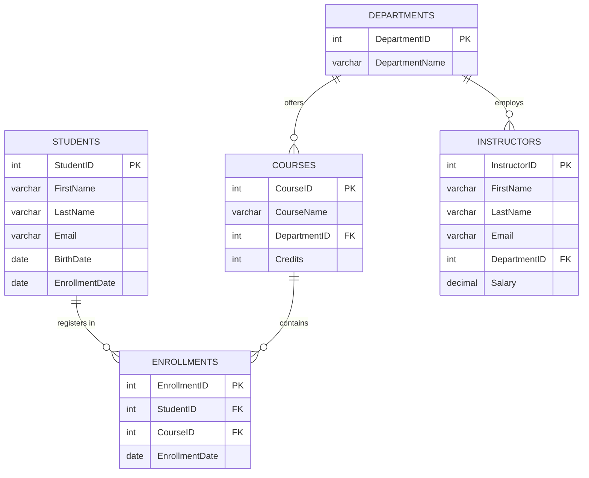

---

<a id="sql-skills"></a>
## 💡 SQL Skills Demonstrated

Through 16 distinct query challenges, this project showcases a progression from basic to advanced SQL:

- **Core CRUD Operations:** `INSERT`, `UPDATE`, `DELETE`, and `SELECT`.
- **Joins:** `INNER JOIN` and `LEFT JOIN` to stitch relational data back together.
- **Aggregations & Grouping:** `GROUP BY`, `HAVING`, `MAX`, `AVG`, and `COUNT` to generate summary statistics.
- **Nested Subqueries:** Filtering data based on the results of separate, internal queries.
- **Window Functions:** Using `OVER(ORDER BY)` to calculate running totals.
- **Conditional Logic:** Utilizing `CASE` statements to dynamically categorize records (e.g., Junior vs. Senior status).
- **Data Manipulation:** Using built-in functions like `CONCAT()`, `YEAR()`, and `TIMESTAMPDIFF()`.

---

<a id="visual-tour"></a>
## 📸 Visual Tour (Screenshots)

Below is a walkthrough of the SQL execution, showing the database in action.

### 🗄️ Database Tables Overview
_Viewing the initial state of the Students, Courses, Instructors, and Enrollments tables._
<p align="center"> 
  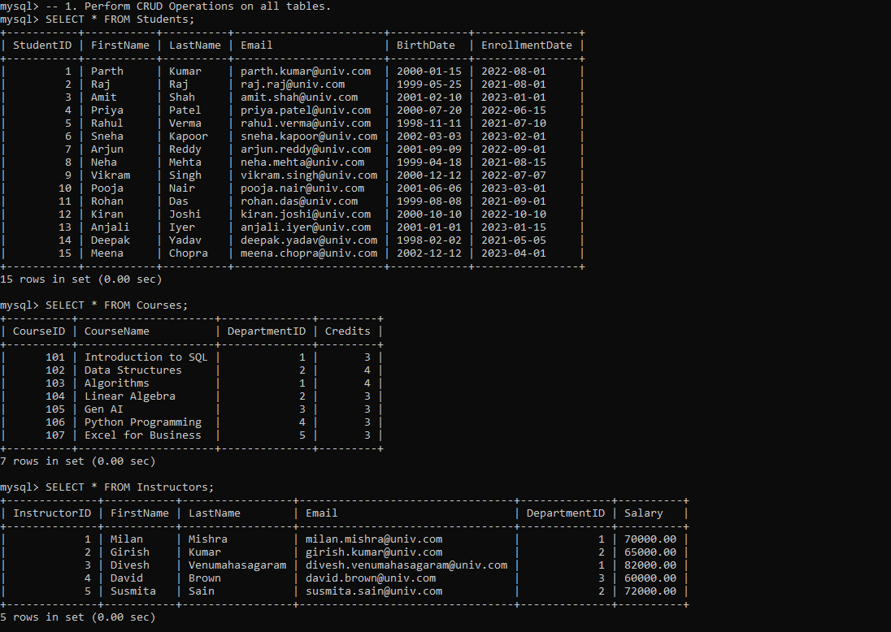 
  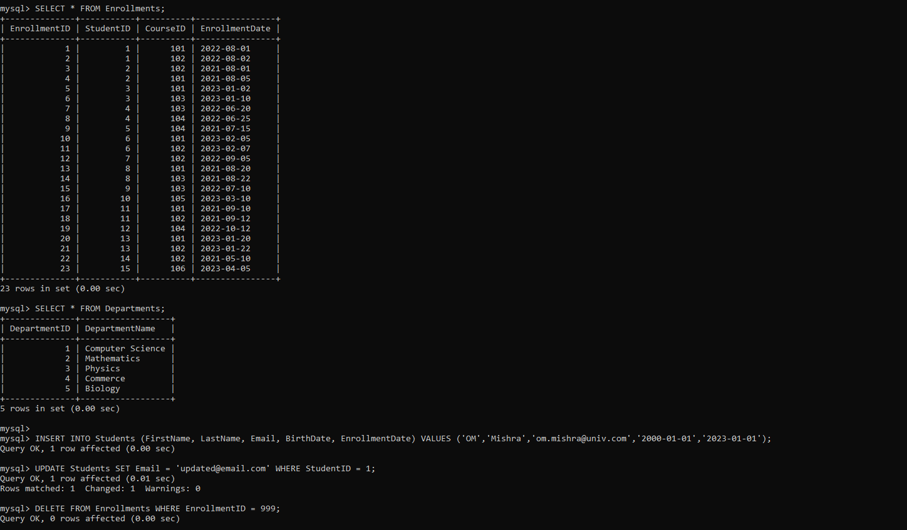 
</p>

### 🔍 Filtering, Aggregation & Subqueries
_Filtering student enrollment dates and analyzing course loads using `HAVING` and nested subqueries._
<p align="center"> 
  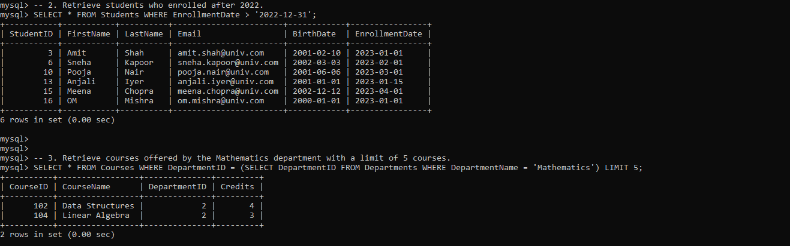 
  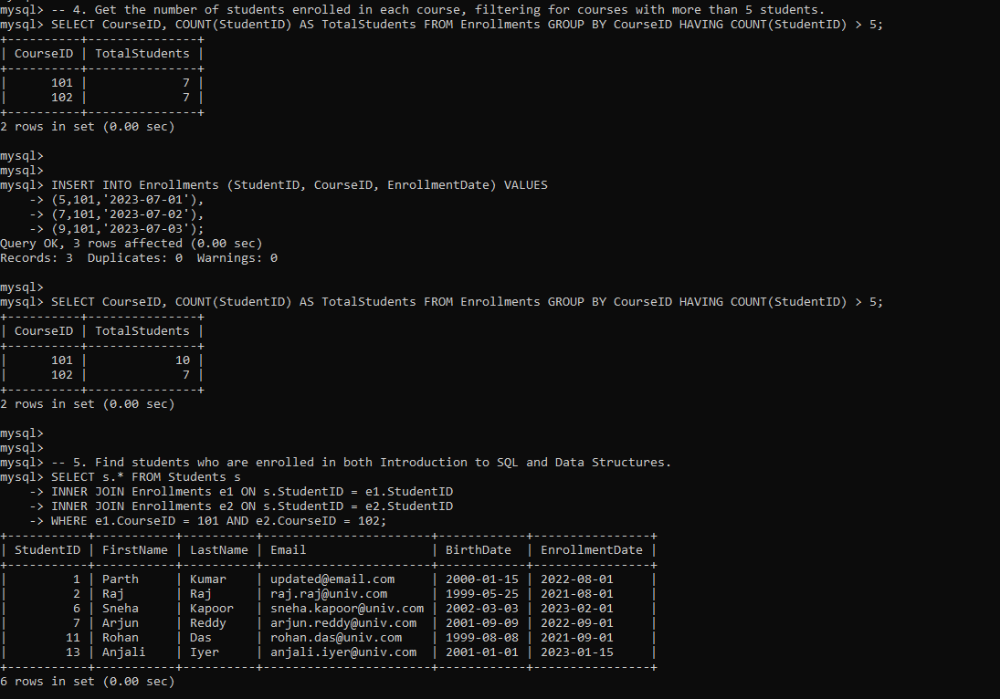 
</p>

### 📊 Advanced Multi-Condition Queries
_Using `DISTINCT`, calculating averages, and utilizing `INNER JOIN` to map students to their respective courses._
<p align="center"> 
  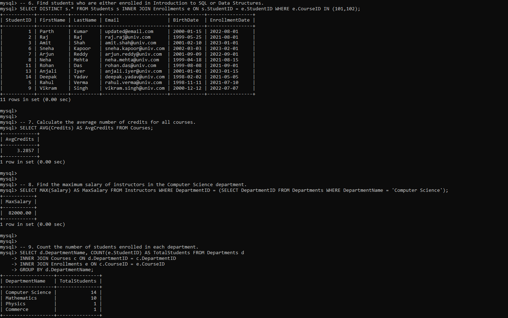 
  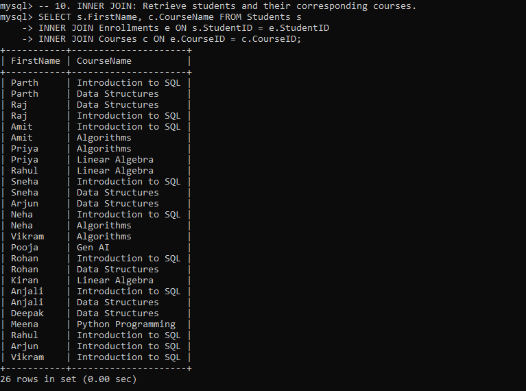 
</p>

### 🔗 JOIN Operations & Deep Filtering
_Demonstrating `LEFT JOIN` for inclusive data retrieval and identifying highly populated courses using subqueries._
<p align="center"> 
  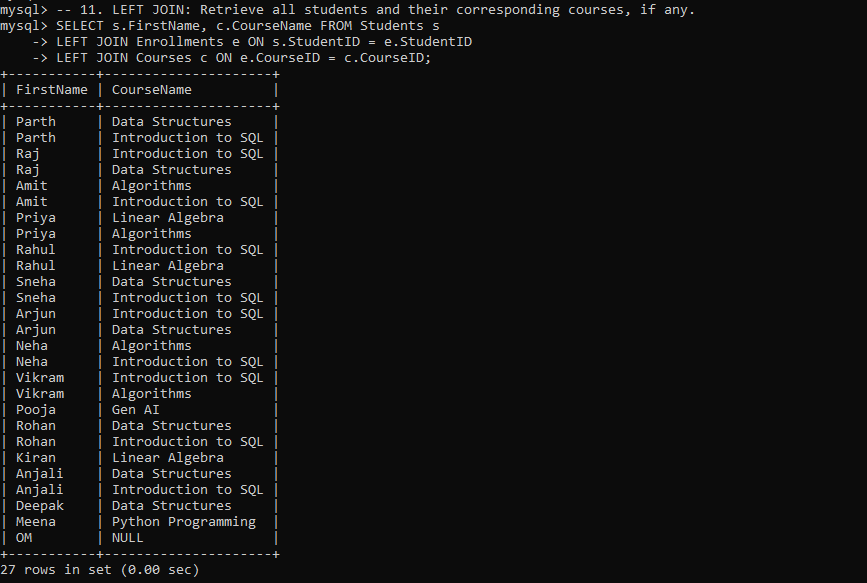 
  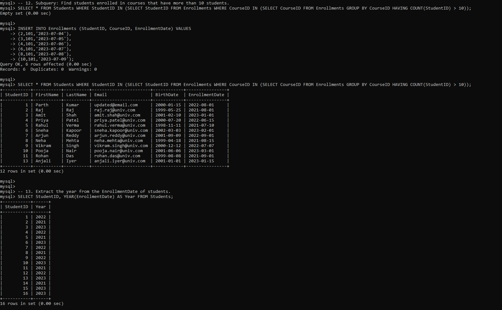 
</p>

### 📈 Window Functions & Conditional Logic
_Extracting dates, concatenating strings, generating running totals with Window Functions, and applying `CASE` statements to categorize student seniority._
<p align="center"> 
  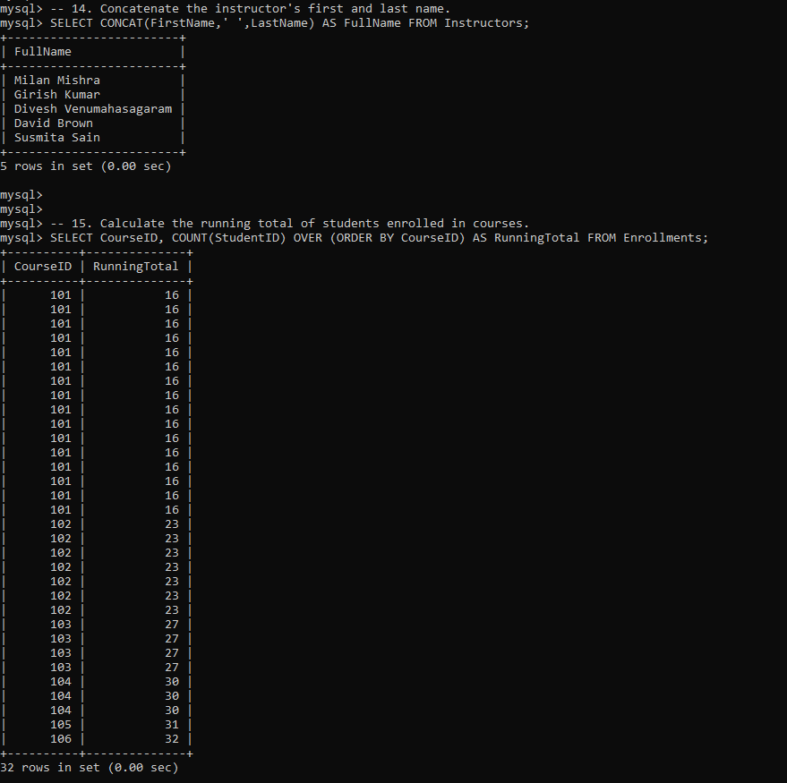 
  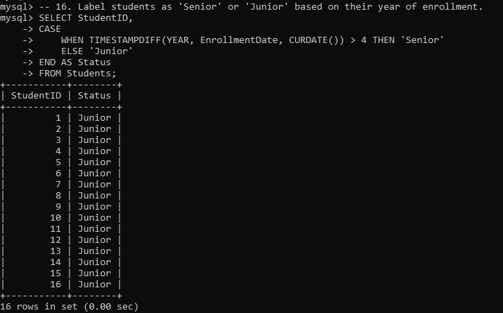 
</p>

---

<a id="project-structure"></a>
## 📁 Project Structure

```text
course-management-system/
│
├── Course_Management.sql   # Complete database schema, dummy data, and query scripts
├── README.md               # Project documentation
└── screenshots/            # Output captures of executed queries
    ├── q1.1.png
    ├── q1.2.png
    ├── q2-3.png
    ├── q4-5.png
    ├── q6-9.png
    ├── q10.png
    ├── q11.png
    ├── q12-13.png
    ├── q14-15.png
    └── q16(1).png
```

---

<a id="getting-started"></a>
## ⚙️ Getting Started / Setup

To run this project locally on your machine, follow these simple steps:

1. **Clone the repository:**
   ```bash
   git clone [https://github.com/yourusername/course-management-system.git](https://github.com/yourusername/course-management-system.git)
   cd course-management-system
   ```

2. **Open your MySQL environment:**
   Launch MySQL Workbench or access your MySQL Command Line Client.

3. **Execute the SQL File:**
   You can copy the contents of `Course_Management.sql` and run it, or source it directly via the terminal:
   ```sql
   SOURCE path/to/Course_Management.sql;
   ```
   *(This will automatically create the `UniversityDB` database, build the tables, populate them with sample data, and run the analytical queries.)*

---

<a id="author"></a>
## 👤 Author

**Dushyant V** _Passionate about SQL, Data Modeling, and Backend Systems._
